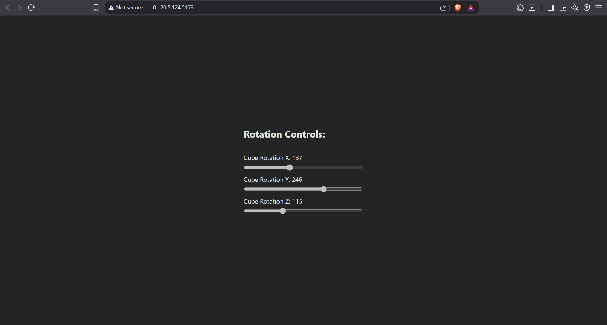
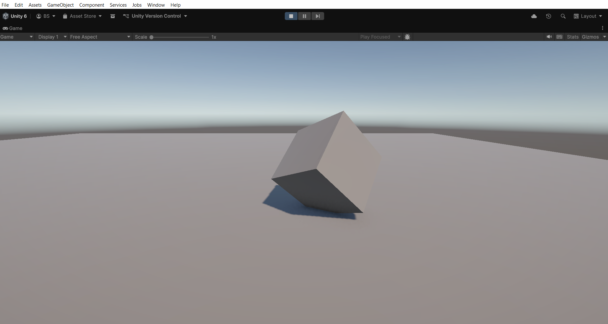

# Real-Time Unity Cube Control via WebSockets

This project demonstrates a full-stack real-time communication pipeline between a **React Web Client** and a **Unity Game Engine** instance. Using a Node.js WebSocket server as a bridge, users can rotate a 3D cube in Unity instantly using web-based sliders.

## 📸 Demo

| **React Web Controller** | **Unity Simulation** |
|:---:|:---:|
|  |  |
| *Controls X, Y, Z rotation values* | *Updates rotation in real-time* |

<br>

### 🎥 Video Reference
[**▶️ Click here to watch the full demo video**](./ReadmeFiles/remoteMake.mp4)
---

## 🚀 Features

- **Low Latency:** Uses `ws` (WebSockets) for instant bidirectional communication.
- **Synchronized State:** The web client sends rotation data; Unity receives and parses it instantly.
- **Smooth Interpolation:** Unity implementation uses `Quaternion.RotateTowards` to smooth out network jitter.
- **Scalable:** The server broadcasts messages to all connected clients.

## 🛠️ Tech Stack

- **Server:** Node.js, `ws` library
- **Frontend:** React.js
- **Game Engine:** Unity (C#)
- **Unity Package:** [NativeWebSocket](https://github.com/endel/NativeWebSocket)

---

## ⚙️ Data Protocol

The systems communicate using a specific JSON schema.

**Payload sent from React:**
```json
{
  "target": "PlayerCube",
  "type": "transform",
  "property": "rotation",
  "axis": "x", 
  "axisValue": 137
}
```

---

## 📦 Installation & Setup

### 1. The WebSocket Server (Node.js)
The server acts as the relay between the web page and Unity.

1. Navigate to the server directory.
2. Install dependencies:
   ```bash
   npm install ws
   ```
3. Run the server:
   ```bash
   node server.js
   ```
   *Output: `WebSocket server running on port 3000`*

### 2. The Web Client (React)
1. Navigate to the client directory.
2. Open `App.js` and ensure the WebSocket IP matches your server's local IP (e.g., `10.120.5.124` or `localhost`):
   ```javascript
   socketRef.current = new WebSocket("ws://YOUR_IP_HERE:3000");
   ```
3. Install dependencies and start the app:
   ```bash
   npm install
   npm start
   ```

### 3. The Unity Project
1. Open the project in Unity.
2. Ensure you have the **NativeWebSocket** package installed.
3. Attach the `PlayerCube.cs` script to a Cube object in your scene.
4. In the Inspector, set the **Server IP** to match your Node.js server (e.g., `10.120.5.124`).
5. Press **Play**.

---

## 📝 Code Overview

### Server (`server.js`)
A simple broadcast server. When it receives a message from the React client, it immediately forwards that message to the Unity client.

### Client (`App.js`)
Uses `useEffect` to establish the connection on load. The `handleRotation` functions package the slider values into the JSON format and send them over the socket.

### Unity (`PlayerCube.cs`)
- **`Connect()`**: Establishes the connection using `NativeWebSocket`.
- **`ProcessCommand()`**: Deserializes the JSON and updates a `cachedRotation` Vector3.
- **`Update()`**: Applies the rotation using `Quaternion.RotateTowards` for visual smoothness.

---

## ⚠️ Troubleshooting

- **Connection Refused?** Ensure your firewall allows traffic on port `3000`.
- **Not Moving?** Make sure the `target` string in React ("PlayerCube") matches the logic in your C# script (though the current script processes all "transform" commands regardless of target name).
- **Mobile Device?** If accessing the React app from a phone, ensure the phone and computer are on the same Wi-Fi network and use the computer's local IP (not `localhost`).